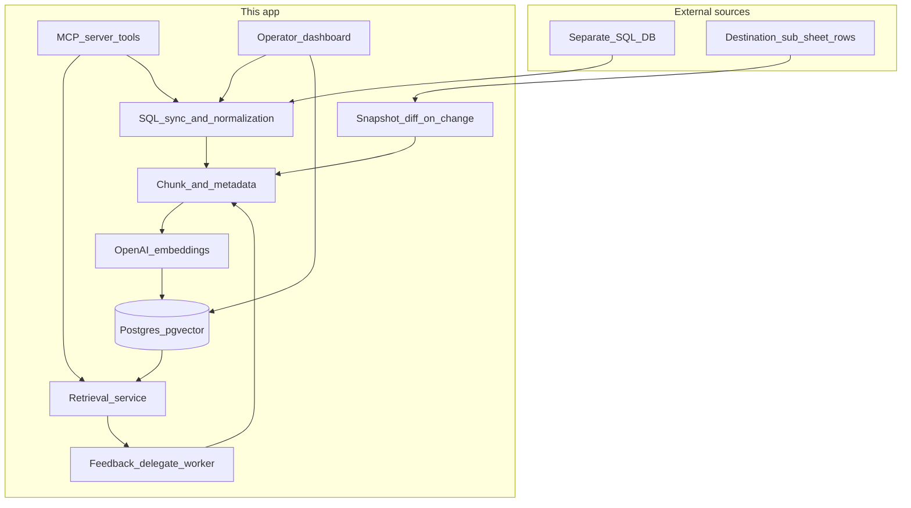

# Feedback MCP agent and dynamic player vector memory

## Context in this repo

- Player-facing sheet data already flows into [`app/services/workspace_service.py`](app/services/workspace_service.py) as **`destination_snapshot`** JSON (`headers` + `rows`) stored in [`WorkspaceContextItem`](app/models/workspace.py).
- Feedback jobs are delegated in [`process_feedback_delegate_job`](app/workers/workspace_worker.py) to the standalone [`agents/feedback`](agents/feedback/) service; results land in `AgentJob.result_json` with `external_ref` = review id.
- A prior internal outline exists at [`.cursor/plans/player_vector_rag_plan_feeb5f3e.plan.md`](.cursor/plans/player_vector_rag_plan_feeb5f3e.plan.md); this plan aligns with it but **commits to your choices**: **separate SQL DB** for source context and **`PLAYER_KEY_*` column list** for identity.

## Target architecture (aligned with your diagram)

- **Orchestration**: Keep retrieval and ingest **in the platform API/worker** (not inside the feedback agent container) so tenant scoping and secrets stay centralized; pass **retrieved context as an optional block** in the JSON body to [`/api/reviews`](agents/feedback/main.py) or extend the delegate payload — whichever minimizes duplication (prefer **one contract**: `player_memory_context: string | null`).

## 1. Infrastructure: pgvector in *this* app’s Postgres

- Switch Compose Postgres to an image with pgvector (e.g. `pgvector/pgvector:pg16`) or run `CREATE EXTENSION vector` via migration — today [`docker-compose.yml`](docker-compose.yml) uses `postgres:16-alpine` without pgvector.
- Add Alembic/SQLAlchemy migrations (pattern alongside [`app/db.py`](app/db.py)) for:
  - **`player_chunks`**: `id`, `workspace_id`, `player_key`, `source_type` (e.g. `sql_sync`, `sheet_row`, `feedback_review`), `source_ref` (opaque id / row hash), `content` (text), `embedding vector(...)`, `metadata jsonb`, `content_hash`, `created_at`, optional `supersedes_chunk_id` for versioning.
  - **`player_profiles`** (optional phase 2): rolling LLM summary per `(workspace_id, player_key)`.
  - **Indexes**: btree on `(workspace_id, player_key)`, HNSW (or IVFFlat after warmup) on `embedding`; partial indexes by `source_type` if query patterns need it.

## 2. Identity: composite `player_key` from env columns

- Add env like `PLAYER_KEY_COLUMNS` (comma-separated logical names matching **normalized** headers / SQL aliases).
- Implement **`normalize_player_key(row: dict) -> str`**: stable lowercase, trim, join with a delimiter (e.g. `|`), optional SHA256 if keys get long — **document** collision handling (same key = same memory bucket).
- Store **`workspace_id`** on every chunk (from [`Workspace`](app/models/workspace.py)); optional future metadata `club_id` if you add it to SQL/sheets later — same chunk table, filter in retrieval.

## 3. Separate SQL database: sync pipeline

- **Config**: `PLAYER_CONTEXT_DATABASE_URL` (psycopg or generic SQLAlchemy URL), read-only credentials recommended.
- **Queries**: parameterized SQL from env or a small YAML manifest (e.g. `PLAYER_CONTEXT_SQL`) returning rows that map to the same column names used for `player_key` plus free-text fields to embed.
- **Workers**:
  - **Scheduled job** (RQ/cron): pull incremental rows (`updated_at` watermark table in *this* DB: `sql_sync_state`) → normalize → chunk → embed → upsert by `content_hash`.
  - **On-demand**: dashboard/MCP `trigger_player_sql_sync(workspace_id)` for operators.
- **Dedup**: hash canonical serialized row text; skip unchanged; **version** or delete stale chunks for the same `(workspace_id, player_key, source_type, source_ref)` when upstream corrects a row.

## 4. Destination sub-sheet → vectors (automated)

- Hook **`append_destination_snapshot_if_changed`** ([`workspace_service.py`](app/services/workspace_service.py)): when `changed=True`, enqueue **embed snapshot diff** job (diff old vs new rows by stable row index or primary column from sheet).
- Map each logical player row to **documents**: header:value lines + optional long fields split by chunking (below).

## 5. Chunking rules (practical defaults)

- **Unit of meaning**: prefer **one semantic chunk** per sheet/SQL row when row text fits ~500–800 tokens; split wide rows on **paragraph boundaries** or **column groups** (e.g. “bio”, “stats”, “notes”).
- **Overlap**: 10–15% token overlap between adjacent chunks from the same row when split.
- **Metadata per chunk**: `source_type`, `source_ref`, `sheet_name` or SQL batch id, `captured_at`, optional `column_subset`.
- **Feedback text**: embed `overall_assessment` + each marker’s `coaching_note` ([`video_feedback_schema.json`](agents/feedback/video_feedback_schema.json)) as separate chunks with `source_type=feedback_review` and `source_ref=review_id/timestamp`.

## 6. Retrieval at feedback time

- Build **query text** from job payload: `player_focus`, `coaching_focus`, `analysis_scope`, sport, plus a short **session label**.
- Embed query → **pgvector similarity** with **mandatory filters** `workspace_id` + `player_key` (no global search).
- Optional **MMR** for diversity; **top_k** 8–20; cap total injected tokens.
- Inject into the delegate call path in [`process_feedback_delegate_job`](app/workers/workspace_worker.py) after resolving `workspace_id` and `player_key` from job payload (may require extending [`FeedbackReviewRequest`](app/api/routes/agents.py) / job payload).

## 7. After feedback: auto-grow memory

- On successful delegate job: parse `result_json`, extract high-signal strings, enqueue **embed feedback outcome** job (same chunk pipeline, linked to `AgentJob.id`).
- Idempotent on `content_hash` so retries do not duplicate semantics.

## 8. “Feedback MCP agent” (tools)

- Implement a **small MCP server** (Python `mcp` SDK or TypeScript) in-repo, e.g. `mcp/player_feedback/`, that calls **authenticated REST** on this API:
  - `player_memory_search` — wraps retrieval service.
  - `player_profile_get` — optional when profiles exist.
  - `trigger_sql_sync` / `trigger_sheet_embed` — operator scope.
- Reuse the pattern described in the repo’s existing plan: MCP is a **thin adapter** over core services — business logic stays in [`app/services/`](app/services/).

## 9. Operator dashboard (dynamic updates)

- Extend static UI pattern ([`app/api/routes/ui.py`](app/api/routes/ui.py) + [`app/static/agents_lab.html`](app/static/agents_lab.html) or new page): **player selector**, **last sync times**, **chunk counts**, **manual “reindex player”** and **paste supplemental note** (creates chunk with `source_type=manual`).
- All writes go through the **same ingestion service** so automation and manual actions share dedup/rules.

## 10. Security and ops

- **Tenant isolation**: every vector query filters `workspace_id`; map MCP/API auth to workspace owner.
- **PII**: configurable redaction list before embed; audit logs with hashed keys.
- **Cost**: batch OpenAI embed calls; cache by `content_hash`.
- **Observability**: structured logs linking `sync_batch_id`, `chunk_id`, `agent_job_id`.

## Suggested rollout phases

1. **pgvector + `player_chunks` + embedding/upsert service + retrieval service** (no UI).
2. **SQL sync worker + snapshot-diff hook** (automated growth).
3. **Wire RAG into feedback delegate** + **embed completed feedback**.
4. **MCP server** + **dashboard** triggers/stats.

## Key files to touch when implementing

| Area | Files |
|------|--------|
| Schema/migrations | New migration module; [`app/db.py`](app/db.py) models |
| Ingest/retrieve | New `app/services/player_memory*.py`, `embedding_service.py` |
| Workers | [`app/workers/workspace_worker.py`](app/workers/workspace_worker.py), new `player_memory_worker.py`, RQ enqueue helpers |
| Feedback API | [`app/api/routes/agents.py`](app/api/routes/agents.py), optionally [`agents/feedback/main.py`](agents/feedback/main.py) for optional context field |
| Snapshot hook | [`app/services/workspace_service.py`](app/services/workspace_service.py) or caller of `append_destination_snapshot_if_changed` |
| Compose | [`docker-compose.yml`](docker-compose.yml) Postgres image |
| MCP | New package under repo root |
| UI | [`app/static/`](app/static/), [`app/api/routes/ui.py`](app/api/routes/ui.py) |
