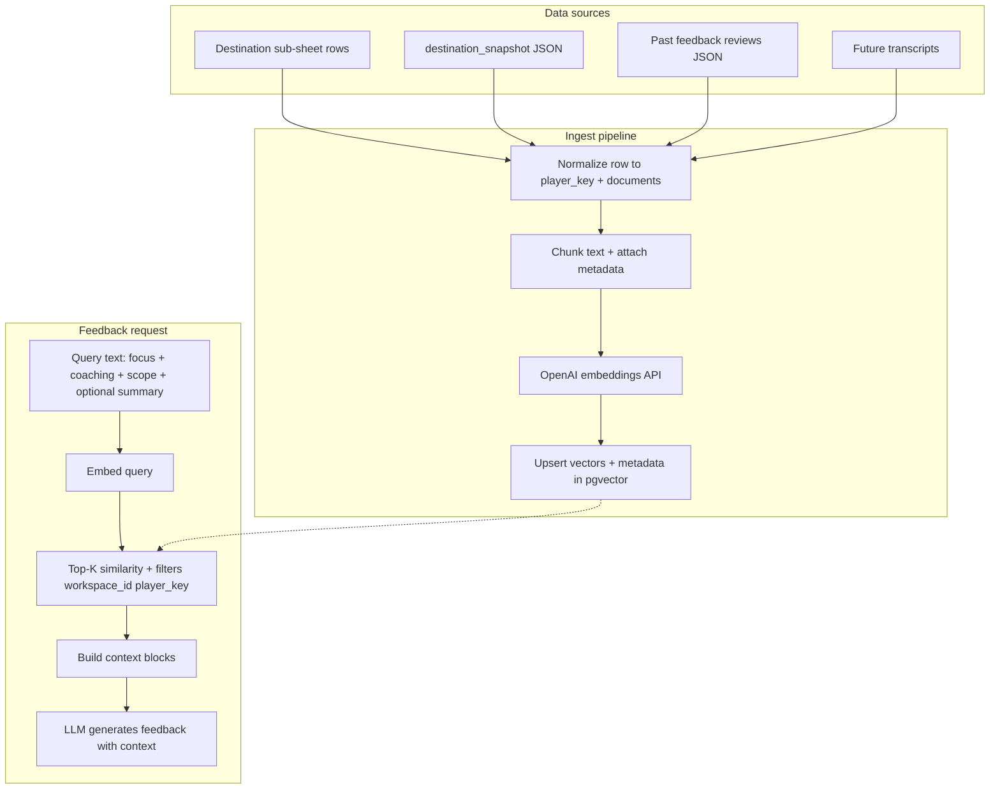
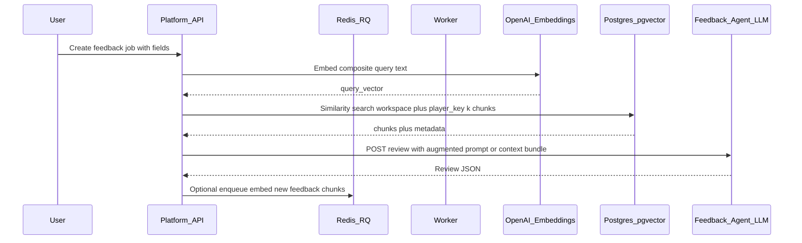

# Player-scoped vector memory and RAG for feedback (A-to-Z)

## Goals

- **Index**: Turn structured + unstructured player-related text (sheet rows, snapshot excerpts, past feedback summaries, optional transcripts) into **embeddings** stored in a **vector DB**, partitioned by **player** (and tied to your existing **workspace / destination tab** model).
- **Retrieve**: On **new feedback** runs, **query** by embedding (and filters) to fetch top-k relevant chunks and pass them to the model as **context**.
- **Profile**: Periodically (or on demand) **synthesize a player profile** from retrieved history + latest rows (not only vectors—use an LLM summary over retrieved text or a rolling profile document you also embed).

**Important scope note:** Today [`app/models/workspace.py`](app/models/workspace.py) is **one workspace per app `user_id`** (Google user), not per athlete. “Player” is a **new axis** (e.g. stable `player_key` from sheet columns: name + team + jersey, or a dedicated **Player ID** column). The plan assumes you define that key and enforce uniqueness within a workspace.

---

## Architecture (recommended stack)

| Layer | Role |
|--------|------|
| **Sources** | Destination sub-sheet rows ([`DestinationSheetService`](app/services/destination_sheet.py)), existing [`destination_snapshot`](app/services/workspace_service.py) payloads, completed **feedback reviews** (JSON from feedback agent), future video transcripts |
| **Chunking** | Split long text into chunks (~500–1500 tokens) with metadata: `workspace_id`, `player_key`, `source_type`, `source_id`, `created_at` |
| **Embeddings** | OpenAI **`text-embedding-3-small`** (default) or **`text-embedding-3-large`**; batch embed on ingest |
| **Vector store** | **`pgvector` extension in existing Postgres** (fits [`docker-compose.yml`](docker-compose.yml) postgres service—no new infra). Alternative: Qdrant Cloud / Pinecone if you want separation later |
| **Orchestration** | Platform API + RQ worker (same pattern as [`workspace_worker.py`](app/workers/workspace_worker.py)): embed jobs, profile refresh jobs |
| **Generation** | Feedback agent or platform builds prompt = **system + player summary + retrieved chunks + current video/task fields** |

“**MCP agent**” in your wording maps cleanly to: **MCP tools** (or your existing [`/mcp/*`](app/api/routes/workflow.py) style HTTP) that expose **ingest**, **search**, and **profile read** to external agents—optional layer on top of core services.

---

## End-to-end flow (conceptual)

---

## Detailed phases (A → Z)

### A. Identity and namespaces

- Define **`player_key`** (string, stable within workspace): e.g. hash of normalized `(team + jersey + legal name)` or a dedicated sheet column **Player ID**.
- Define **`namespace_key`** for vectors: recommend **`{workspace_id}:{player_key}`** as filter metadata (and optionally **destination `sheet_name`** for debugging).

### B. Schema (Postgres + pgvector)

- Enable **`pgvector`** on Postgres used by `DATABASE_URL`.
- New tables (illustrative):
  - **`player_profiles`** — `workspace_id`, `player_key`, `summary_text`, `summary_json`, `updated_at` (LLM-generated profile).
  - **`player_chunks`** — `id`, `workspace_id`, `player_key`, `content`, `embedding vector(...)`, `metadata jsonb`, `content_hash`, `created_at`.
- Index: **HNSW** or **IVFFlat** on `embedding` + btree on `(workspace_id, player_key)`.

### C. What to embed (chunk design)

- **Sheet rows**: one chunk per row or split wide rows (game details + link + position).
- **Feedback outputs**: `overall_assessment` + each marker’s `coaching_note` (from [`agents/feedback`](agents/feedback/) review JSON schema)—high signal for “past coaching style.”
- **Snapshots**: optional diff-only ingest when snapshot hash changes (avoid re-embedding unchanged rows via content hash).

### D. Ingestion triggers

1. **After destination_snapshot refresh** or **after sheet sync** writes new/changed rows → enqueue **embedding job** per changed `(workspace_id, player_key)` batch.
2. **After feedback job completes** ([`process_feedback_delegate_job`](app/workers/workspace_worker.py)) → fetch review JSON from feedback agent (or store summary in DB when job completes) → embed.

### E. Retrieval at feedback time

1. Build **query text** from: `player_focus`, `coaching_focus`, `analysis_scope`, sport, optional **current row** fields, and short **session summary**.
2. Call embeddings API → **vector search** restricted to `workspace_id` + `player_key`, **top_k** (e.g. 8–20), **MMR** optional for diversity.
3. Inject into prompt under a fixed delimiter, e.g. “Retrieved player memory (cite internally, do not invent facts): …”

### F. Player profile generation

- **Batch job**: retrieve top chunks + latest sheet-derived facts → LLM produces structured profile (strengths, recurring themes, positions, workload)—store in **`player_profiles`** and optionally **embed the summary** as a single “profile chunk” for fast retrieval.
- **Cadence**: on every N new chunks or nightly.

### G. MCP / agent surface (optional but aligned with your direction)

Expose tools such as:

- `player_memory_search(workspace_id, player_key, query, k)`
- `player_profile_get(workspace_id, player_key)`
- `player_memory_upsert(...)` (admin-only)

Implementation options: **Cursor MCP server** wrapping your REST API, or extend existing MCP-style routes under [`app/api/routes/workflow.py`](app/api/routes/workflow.py) with auth.

### H. Security and correctness

- **Tenant isolation**: every query **must** filter `workspace_id` (and `player_key`)—no global vector search.
- **PII**: strip or minimize sensitive fields before embedding if needed; log only hashed IDs.
- **Cost**: batch embeddings; cache embedding for identical `content_hash`; rate-limit ingest.

### I. Observability

- Metrics: embed latency, tokens, chunks written, retrieval hit rate, feedback job latency.
- Trace IDs linking **sheet row → chunk IDs → feedback job ID**.

### J. Rollout

1. **Phase 1**: pgvector + ingest from completed feedback JSON only (smallest scope).
2. **Phase 2**: ingest destination rows + snapshot diffs.
3. **Phase 3**: profile job + MCP tools + Agent Lab toggles for “use memory.”

---

## Feedback generation sequence (sequence diagram)

---

## Key decisions to lock before implementation

- **Player identity**: which sheet columns define `player_key` (required).
- **Vector store**: **pgvector in Postgres** (simplest with current stack) vs external vector DB.
- **Where RAG is stitched**: **platform worker** before calling feedback agent (centralized) vs **inside feedback agent** (couples agent to DB)—platform-side is usually easier to secure and tenant-scope.

---

## Files likely touched later (when implementing)

- New migration / models adjacent to [`app/models/workspace.py`](app/models/workspace.py)
- New services: `embedding_service.py`, `player_memory_service.py`, `retrieval_service.py`
- Worker hooks in [`app/workers/workspace_worker.py`](app/workers/workspace_worker.py) and/or new worker module
- Feedback agent prompt in [`agents/feedback/review_agent.py`](agents/feedback/review_agent.py) / [`openai_service.py`](agents/feedback/openai_service.py) to accept **optional context block**
- [`docker-compose.yml`](docker-compose.yml): Postgres image supports pgvector (use `pgvector/pgvector` image or install extension in init script)
