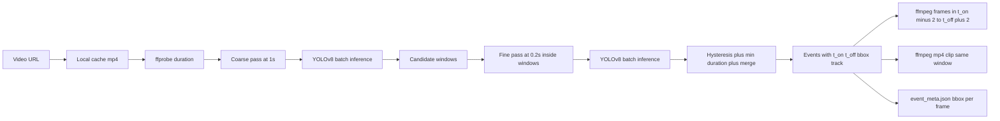

## Why the current pipeline is unreliable

Today in [agents/feedback/video_utils.py](agents/feedback/video_utils.py):

- `_detect_red_ring_image` (HSV mask + `cv2.HoughCircles` + contour fallback) and `_detect_white_pointer_image` are brittle against red jerseys, ads, crowd flags, motion blur, ring notches, and non-Veo overlays.
- `probe_circle_timeline` runs one full `ffmpeg` seek per probe at 0.25s intervals, so a 10-min CDN video costs 2000+ seeks (`VIDEO_CIRCLE_MAX_PROBES` cap) and is slow + flicker-prone.
- Per-frame detection is independent (no temporal smoothing, no tracking), so a single noisy frame can split an event or trigger a false positive.

## Target architecture



Everything below lives under a new module `agents/feedback/highlight/` so the legacy path in [agents/feedback/video_utils.py](agents/feedback/video_utils.py) and [agents/feedback/review_agent.py](agents/feedback/review_agent.py) stays intact and is switched on/off with an env flag.

## Phase 1 — Dataset (offline, not in the deployed image)

New folder `agents/feedback/training/` (not copied into the Docker image).

- `prepare_dataset.py` — given a list of sample videos, extract candidate frames every 0.5s at 640px width via the existing `extract_frame_at_timestamp`. Output flat `dataset/raw/<video_id>/frame_<ts>.jpg`.
- Label in Roboflow (recommended) or CVAT with **one class `highlight_overlay`** (single class keeps the model small and platform-agnostic — covers Veo red ring, Hudl marker, Trace pointer, custom red ring). Export YOLOv8 format.
- Target v1 dataset: 300-500 positive frames + 200 negative frames, balanced across platforms. Roboflow augmentations (hue shift, blur, brightness) effectively triple this.

## Phase 2 — Training (offline)

`agents/feedback/training/train.py`:

- Base: `yolov8n.pt` (3 MB, runs on CPU at ~30 ms/frame at 640px).
- Fine-tune via `ultralytics` Python API: `model.train(data=..., epochs=80, imgsz=640, batch=16)`.
- Output: `best.pt` (~6-8 MB) committed to a separate `models/` location (S3 or `agents/feedback/models/highlight_yolo_v1.pt`).
- `evaluate.py` reports precision/recall and a confusion matrix on a held-out video.

## Phase 3 — Inference module (deployed)

New `agents/feedback/highlight/yolo_detector.py`:

- `class HighlightDetector` lazy-loads `ultralytics.YOLO(model_path)`; model path from `VIDEO_HIGHLIGHT_YOLO_WEIGHTS` env (defaults to `agents/feedback/models/highlight_yolo_v1.pt`).
- `predict_batch(images: list[np.ndarray]) -> list[Detection]` runs CPU batch inference (`batch_size=16`), filters by `conf >= VIDEO_HIGHLIGHT_YOLO_CONF` (default 0.45), returns `(found, bbox_xyxy_norm, conf)` per image.
- A thin adapter `detect_highlight_overlay_yolo(image_path)` provides the same return shape as the existing `detect_highlight_overlay` in [agents/feedback/video_utils.py](agents/feedback/video_utils.py) so callers stay compatible.

## Phase 4 — Efficient probing (deployed)

New `agents/feedback/highlight/probe.py`:

- **Local cache** — for HTTPS URLs, download once to `DATA_DIR/cache/<sha>.mp4` (resumable, capped by `VIDEO_HIGHLIGHT_CACHE_MAX_GB`). Eliminates per-seek HTTP round trips. Fallback to streaming seeks when caching is disabled.
- **Coarse pass** — sample every `VIDEO_HIGHLIGHT_COARSE_INTERVAL_SEC` (default **1.0s**) using one ffmpeg `select` invocation per chunk (~60s of video → one ffmpeg call writing N JPEGs). Replaces the per-timestamp seeks in `probe_circle_timeline` with batched output:

```bash
ffmpeg -y -ss <chunk_start> -i video.mp4 -t 60 \
  -vf "fps=1,scale=640:-1:flags=bicubic,format=yuvj420p" \
  -q:v 3 coarse_%05d.jpg
```

- **Fine pass** — for each coarse candidate window (any ON probe), re-sample at `VIDEO_HIGHLIGHT_FINE_INTERVAL_SEC` (default **0.2s**) using the same batched-fps approach. Tightens the t_on / t_off boundaries.
- Both passes feed `HighlightDetector.predict_batch`.

Net effect: a 10-min video drops from ~2400 single seeks to roughly 10 batched ffmpeg invocations.

## Phase 5 — Events with smoothing and tracking

New `agents/feedback/highlight/event_extractor.py`:

- Build a per-timestamp signal `(t, conf, bbox)`.
- **Hysteresis** — enter ON when `conf >= conf_on` (0.55), stay ON while `conf >= conf_off` (0.35). Suppresses flicker.
- **Min duration** — drop events shorter than `VIDEO_HIGHLIGHT_EVENT_MIN_SEC` (default 0.4s).
- **Merge** — merge events whose gap is < `VIDEO_HIGHLIGHT_EVENT_MERGE_SEC` (default 1.5s) **and** whose last/first bbox IoU > 0.3 (same player). Replaces today's blunt `VIDEO_CIRCLE_MIN_GAP_SEC=3` heuristic.
- **Cap** — keep top-K events by mean confidence if more than `VIDEO_HIGHLIGHT_MAX_EVENTS` (default 25).

Each event is:

```python
@dataclass
class HighlightEvent:
    index: int
    t_on: float
    t_off: float
    t_lo: float          # t_on - pad
    t_hi: float          # t_off + pad
    bbox_track: list[tuple[float, dict]]   # [(t, {x,y,w,h normalized, conf})]
    mean_conf: float
```

## Phase 6 — Per-event outputs (the user's main ask)

New `agents/feedback/highlight/event_assets.py`:

For each event:

1. **Frames** in `[t_on - 2, t_off + 2]` written to `reviews/<id>/events/event_<NN>/frames/`. Single ffmpeg call per event:

```bash
ffmpeg -y -ss <t_lo> -i video.mp4 -t <t_hi - t_lo> \
  -vf "fps=<frames_per_sec>,scale=960:-1,format=yuvj420p" \
  -q:v 3 frame_%03d.jpg
```

`frames_per_sec` derives from `VIDEO_HIGHLIGHT_EVENT_FRAME_FPS` (default 3 fps → ~18 stills for a 6s window; tunable).

2. **Clip** mp4 in the same window written to `reviews/<id>/events/event_<NN>/clip.mp4`. Single ffmpeg call, copy codec when possible:

```bash
ffmpeg -y -ss <t_lo> -i video.mp4 -t <t_hi - t_lo> \
  -c copy -avoid_negative_ts make_zero clip.mp4
```

Fall back to re-encode (`-c:v libx264 -preset veryfast -crf 23`) if `copy` fails for non-keyframe-aligned starts.

3. **Bounding-box metadata** — for each saved frame, run the YOLO detector once more (or reuse fine-pass detections by nearest timestamp) and write `event_meta.json`:

```json
{
  "event_index": 3,
  "t_on": 10.12, "t_off": 12.04, "t_lo": 8.12, "t_hi": 14.04,
  "frames": [
    {"file": "frame_001.jpg", "timestamp_sec": 8.33, "bbox": {"x": 0.42, "y": 0.51, "w": 0.06, "h": 0.10, "conf": 0.71}},
    ...
  ]
}
```

4. **Annotated previews** — optional overlay JPEGs with the bbox drawn (reuse `draw_bbox_overlay` in [agents/feedback/video_utils.py](agents/feedback/video_utils.py)) under `event_<NN>/annotated/`.

5. **Top-level index** — `reviews/<id>/events/events.json` lists every event with paths so the UI / downstream OpenAI vision step can iterate.

## Phase 7 — Wire into the review pipeline

In [agents/feedback/review_agent.py](agents/feedback/review_agent.py), `_try_circle_segment_episode_review` gets a new branch behind `VIDEO_HIGHLIGHT_DETECTOR=yolo` (default `hsv` for back-compat, flip to `yolo` once validated):

```text
if detector == "yolo":
    events = run_yolo_pipeline(video_url, base_dir, ...)
    for ev in events:
        assets = build_event_assets(ev, video_url, base_dir, ...)
        vision_out = vision_analyze_circle_segment(frame_paths=assets.frame_paths, ...)
        ...
else:
    # existing probe_circle_timeline / circle_visibility_segments_from_probes path
```

The existing `vision_analyze_circle_segment` and `synthesize_overall_from_circle_segments` in [agents/feedback/openai_service.py](agents/feedback/openai_service.py) continue to consume the per-event frames — no changes needed there.

## Phase 8 — Config and dependencies

New env vars (documented in [app/.env.example](app/.env.example)):

```
VIDEO_HIGHLIGHT_DETECTOR=yolo               # yolo|hsv
VIDEO_HIGHLIGHT_YOLO_WEIGHTS=agents/feedback/models/highlight_yolo_v1.pt
VIDEO_HIGHLIGHT_YOLO_CONF=0.45
VIDEO_HIGHLIGHT_YOLO_BATCH=16
VIDEO_HIGHLIGHT_COARSE_INTERVAL_SEC=1.0
VIDEO_HIGHLIGHT_FINE_INTERVAL_SEC=0.2
VIDEO_HIGHLIGHT_EVENT_PAD_SEC=2.0
VIDEO_HIGHLIGHT_EVENT_FRAME_FPS=3
VIDEO_HIGHLIGHT_EVENT_MIN_SEC=0.4
VIDEO_HIGHLIGHT_EVENT_MERGE_SEC=1.5
VIDEO_HIGHLIGHT_MAX_EVENTS=25
VIDEO_HIGHLIGHT_CACHE_MAX_GB=10
```

Dependencies added to the feedback agent's requirements:

- `ultralytics>=8.2` (pulls torch CPU automatically)
- `torch>=2.2 (CPU build)` pinned via the ultralytics extras

In [agents/feedback/Dockerfile](agents/feedback/Dockerfile):

- Already has `ffmpeg` + `tesseract-ocr`. Add `libgl1` (OpenCV) if not already pulled.
- Copy `agents/feedback/models/highlight_yolo_v1.pt` into the image.

## Phase 9 — Validation and rollout

- Build a fixture set of 5-10 short videos per platform (Veo, Hudl, Trace, custom) with manually annotated event windows.
- A small `agents/feedback/training/evaluate_pipeline.py` runs the full pipeline against the fixtures and prints precision/recall/IoU vs ground truth, plus per-event timing.
- Stage 1 ship: `VIDEO_HIGHLIGHT_DETECTOR=hsv` by default, dogfood `yolo` per request.
- Stage 2 ship: flip default to `yolo` once fixtures show >0.9 recall and <0.05 false-positive-event rate.
- Keep the HSV detector as the documented fallback when weights file is missing.

## Out of scope (called out so we don't scope-creep)

- Player identification (jersey number / face) inside the bbox — separate problem.
- Audio-based event detection.
- Real-time / streaming detection (this is batch).