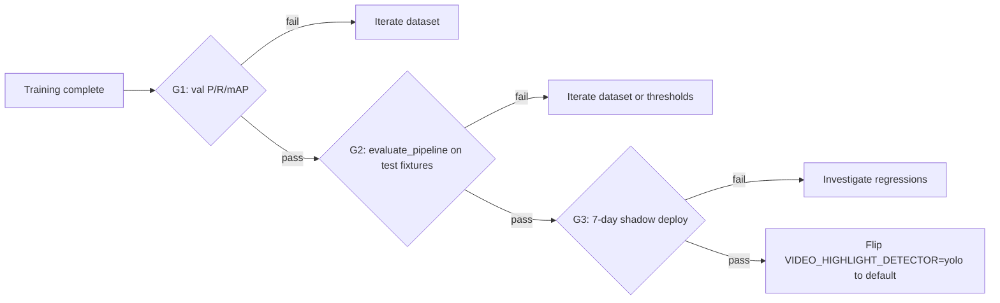

# Production playbook

How to ship, validate, monitor, and improve the highlight-overlay detector in production. Read `DATA_STRATEGY.md` and `TRAINING_GUIDE.md` first — this doc starts where they leave off.

## 1. Launch targets

Concrete numbers — these are what we promise before flipping `VIDEO_HIGHLIGHT_DETECTOR=yolo` to the default.

| Metric | v1 launch gate | v2+ steady state |
|---|---|---|
| Precision (val) | ≥ 0.85 | ≥ 0.92 |
| Recall (val) | ≥ 0.90 | ≥ 0.95 |
| mAP@0.5 (val) | ≥ 0.85 | ≥ 0.92 |
| Pipeline event recall (held-out fixtures) | ≥ 0.90 | ≥ 0.95 |
| Pipeline false-positive event rate | ≤ 0.05 | ≤ 0.02 |
| Per-frame CPU inference @ 640px | ≤ 40 ms | ≤ 25 ms |
| Cold start (model load) | ≤ 5 s | ≤ 3 s |

## 2. Model choice — start with YOLOv8n, escalate only if forced

| Variant | Params | Size | CPU latency @640 | When to use |
|---|---|---|---|---|
| **yolov8n** | 3.2 M | ~6 MB | ~30 ms | **Default. Use this.** |
| yolov8s | 11.2 M | ~22 MB | ~80 ms | Only if v2 dataset can't break 0.92 P/R with v8n |
| yolov8m+ | 25 M+ | ~50 MB+ | 150+ ms | Don't. Diminishing returns for a single-class overlay. |

Why yolov8n is the right default:

- 6 MB ships into the Docker image without inflating cold start.
- ~30 ms/frame on CPU lets the fine pass run on 5 fps for a 5-minute candidate window in under 8 seconds.
- For a single class with strong color/shape priors, larger backbones often overfit to the training distribution and *worsen* generalization across platforms.

## 3. The three gates

Every model version passes G1 → G2 → G3 before the production default flips.



| Gate | Tool | Pass criteria |
|---|---|---|
| **G1 — model** | `yolo_model/scripts/evaluate.py` | precision ≥ 0.85, recall ≥ 0.90, mAP50 ≥ 0.85 |
| **G2 — pipeline** | `yolo_model/scripts/evaluate_pipeline.py` | event recall ≥ 0.90, fp-event rate ≤ 0.05 across all fixtures |
| **G3 — shadow** | Run yolo + hsv in parallel for 7 days; log diffs | yolo never misses an event hsv caught; ≤ 5% extra events vs hsv |

If G1 passes but G2 fails, the problem is almost always:

- Hysteresis thresholds (`VIDEO_HIGHLIGHT_EVENT_CONF_ON` / `_CONF_OFF`) — tune.
- Probe interval (`VIDEO_HIGHLIGHT_COARSE_INTERVAL_SEC`) — coarsen or refine.
- Merge gap (`VIDEO_HIGHLIGHT_EVENT_MERGE_SEC`) — usually not the model itself.

If G2 passes but G3 fails, the problem is data-distribution drift — production videos contain a style not in the dataset. Add those examples to v_next.

## 4. Versioning

```
highlight_yolo_v<major>.<minor>.<patch>.pt
```

- **patch** (`v1.0.1`): same architecture, same dataset version, different seed or hyperparameter sweep.
- **minor** (`v1.1.0`): new dataset version (more data, more platforms, more hard negatives).
- **major** (`v2.0.0`): different architecture (yolov8n → yolov8s) or class-schema change.

## 5. Model card (ship with every release)

Place this next to every weights file. Template:

```markdown
# highlight_yolo_v1.0.0

- Base: yolov8n.pt
- Dataset: dataset_v1.0.0 (sha1: <hash of data.yaml>)
  - 500 positives, 200 negatives
  - 4 platforms (Veo / Hudl / Trace / custom)
- Train: 80 epochs, imgsz 640, batch 16, A100, seed 42
- W&B run: <url>
- Val (held-out videos):
  - precision: 0.91
  - recall: 0.93
  - mAP50: 0.89
- Pipeline eval (5 fixtures):
  - event recall: 0.92
  - false-positive event rate: 0.03
- Known failure modes:
  - Red goal frame at certain stadiums
  - Trace pointer when athlete is on far sideline (small overlay)
- Promoted to default on: 2026-MM-DD
- Promoted by: <name>
- Rollback target: highlight_yolo_v0.9.0.pt
```

Save as `yolo_model/weights/highlight_yolo_v1.0.0.card.md` (commit to git).

## 6. Shadow deployment (G3)

Run the YOLO model alongside the HSV detector for one week without using its output. Compare to gain confidence before flipping the default.

Implementation sketch (not yet shipped in code):

```
VIDEO_HIGHLIGHT_DETECTOR=hsv          # still production
VIDEO_HIGHLIGHT_SHADOW_DETECTOR=yolo  # also run yolo, log diffs
```

For each review, write `shadow_diff.json` containing:

- HSV events (t_on, t_off)
- YOLO events (t_on, t_off, conf)
- Overlap stats: matched events, HSV-only events, YOLO-only events, mean temporal IoU on matches

After 7 days, aggregate diffs. Promotion criteria:

- YOLO recovered ≥ 95% of HSV events.
- YOLO produced ≤ 5% extra events beyond HSV (additional true positives are OK; we just need to look at them manually to confirm they aren't hallucinations).
- Mean temporal IoU on matched events ≥ 0.6.

When you're ready to wire this in, the right place is a small helper inside `agents/feedback/highlight/pipeline.py` (run both detectors, write the diff) called from `review_agent._try_circle_segment_episode_review`.

## 7. Gradual rollout

Once shadow looks clean, do not flip the global default on day one. Stage by workspace:

1. **Day 0**: `VIDEO_HIGHLIGHT_DETECTOR=yolo` for internal workspaces only.
2. **Day 3**: enable for 10% of external workspaces (deterministic by `hash(workspace_id) % 100 < 10`).
3. **Day 7**: 50%.
4. **Day 14**: 100%, flip default in `app/.env.example`.
5. **Day 30**: remove the HSV path from `review_agent.py` if no regressions reported.

Skip the percentage rollout only if shadow showed perfect agreement on >95% of events, but always keep the internal-only stage.

## 8. Rollback

Keep the previous two `.pt` files on the deploy host (or S3 bucket). Rollback is a one-line env change:

```bash
VIDEO_HIGHLIGHT_YOLO_WEIGHTS=agents/feedback/models/highlight_yolo_v0.9.0.pt
```

No image rebuild needed. The symlink convention (`agents/feedback/models/highlight_yolo_v1.pt` → `highlight_yolo_v1.0.0.pt`) keeps this simple:

```bash
# Promote
ln -sf highlight_yolo_v1.0.0.pt agents/feedback/models/highlight_yolo_v1.pt

# Rollback
ln -sf highlight_yolo_v0.9.0.pt agents/feedback/models/highlight_yolo_v1.pt
```

## 9. Continuous improvement (data flywheel)

This is what separates a v1 model from a production model. Every production detection is potential training data.

### 9.1 Auto-mining

For each completed review, write a side log entry:

| Field | Source |
|---|---|
| review_id | self |
| event_index | from `events.json` |
| timestamp_sec | from `event_meta.json` |
| yolo_conf | from `event_meta.json` |
| frame_path | from `event_meta.json` |
| hsv_agree | shadow run |
| human_corrected | manual review by coach (optional) |

### 9.2 Active learning queries

Once a month, sample frames for re-labeling. Prioritize:

1. Frames where `0.30 ≤ yolo_conf ≤ 0.60` (uncertain). Highest learning signal.
2. Frames where `hsv_agree = false` AND `yolo_conf ≥ 0.70`. Either a YOLO false positive or an HSV miss — both valuable.
3. Frames flagged by humans as wrong. Rare but gold.

Target: 200 new labeled frames per month. After 6 months you have ~1700 frames on top of the v1 base.

### 9.3 Retraining cadence

| Trigger | Action |
|---|---|
| 200 new labeled frames in queue | Retrain → patch version |
| New platform appears (e.g. Pixellot) | Pause, gather ≥ 80 frames, retrain → minor version |
| Production recall drops below 0.90 (measured weekly) | Investigate, retrain → patch version |
| Production fp rate exceeds 0.05 | Investigate, raise conf threshold or retrain |

## 10. Inference optimization

Once the model is locked in, these levers reduce latency without changing accuracy.

### 10.1 ONNX export (~2-3x CPU speedup)

```python
from ultralytics import YOLO
YOLO("yolo_model/weights/highlight_yolo_v1.0.0.pt").export(
    format="onnx", dynamic=True, simplify=True,
)
# Produces highlight_yolo_v1.0.0.onnx
```

Run with `onnxruntime` instead of Ultralytics at inference time. Not shipped in `yolo_detector.py` yet; treat as a v2 task.

### 10.2 Image size sweep

Sometimes `imgsz=544` is the sweet spot. Run a small sweep:

| imgsz | mAP50 | CPU ms/frame |
|---|---|---|
| 480 | -0.02 | 18 |
| 544 | -0.01 | 24 |
| **640** | baseline | 30 |
| 768 | +0.005 | 45 |

Tune via `VIDEO_HIGHLIGHT_YOLO_IMGSZ`.

### 10.3 Quantization

INT8 quantization via ONNX runtime gives another ~2x speedup at a typical ~0.01 mAP50 cost. Worth doing for v3+.

## 11. Monitoring in production

Track these per week:

- **Detection rate** — events / hour of video processed. Sudden drop = model regression or upstream video issue.
- **Mean YOLO confidence** of detected events — sudden drop = distribution drift.
- **Pipeline-level recall** — sample 5 random reviews / week, manually annotate, compute recall. Target ≥ 0.90.
- **Inference latency p95** — track per workspace; bumps suggest cache misses or CDN slowness, not the model.
- **Fallback rate** — count reviews where YOLO unavailable forced HSV fallback. Should be near zero.

Build a small dashboard reading the `generation_debug.video_highlight_captions` block in each `review.json`.

## 12. Repository hygiene

- Never commit `.pt` files to git (`yolo_model/weights/.gitignore` enforces this).
- Always commit the model card (`.card.md`).
- Always commit the fixture manifest used for G2.
- Pin `ultralytics` and `torch` versions in `agents/requirements.txt`.
