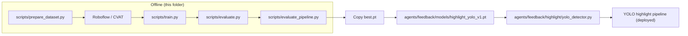

# yolo_model — highlight overlay YOLO detector

This folder owns **everything needed to train and ship the YOLOv8 highlight-overlay detector** that powers the feedback agent's red-circle event extraction. It is intentionally separate from the deployed agent code under `agents/feedback/` so that:

- Training pipelines, datasets, and large model artifacts never bloat the runtime Docker image.
- Anyone joining the project finds a single place that answers "how was this model built?".
- Versioning the model is decoupled from versioning the application.

## How this connects to the deployed agent

The deployed agent reads weights from `agents/feedback/models/highlight_yolo_v1.pt` (path overridable with the `VIDEO_HIGHLIGHT_YOLO_WEIGHTS` env var). Everything in `yolo_model/` produces that file; nothing in `yolo_model/` is imported at runtime.

## Quick start

If you just want to ship a v1 model end to end, follow these in order:

1. Read `DATA_STRATEGY.md` once. The data, not the architecture, is what makes this model good.
2. Run the training pipeline from `TRAINING_GUIDE.md` (sample → label → train → evaluate → ship).
3. Validate with the pipeline gate (`scripts/evaluate_pipeline.py`).
4. Promote to production using the checklist in `PRODUCTION_PLAYBOOK.md`.

## Files in this folder

| File | What it answers |
|---|---|
| `README.md` | This file. Navigation + how the model relates to the runtime. |
| `TRAINING_GUIDE.md` | The exact commands to train a model from scratch. |
| `DATA_STRATEGY.md` | What videos to collect, how to label, dataset versioning, hard negatives. |
| `PRODUCTION_PLAYBOOK.md` | Versioning scheme, three gates, shadow deploy, rollout, rollback, retraining cadence, inference optimization. |
| `scripts/prepare_dataset.py` | Sample raw frames from a list of videos for labeling. |
| `scripts/train.py` | Fine-tune YOLOv8 (the recipe baked in here is the production recipe). |
| `scripts/evaluate.py` | Val-set metrics (model gate G1). |
| `scripts/evaluate_pipeline.py` | End-to-end pipeline metrics on annotated fixtures (pipeline gate G2). |
| `fixtures/` | Ground-truth manifests for `evaluate_pipeline.py`. |
| `weights/` | Staging area for `best.pt` during experimentation. Production weights live in `agents/feedback/models/`. |

## Where the runtime detector lives

The detector implementation, runtime config, and event pipeline are NOT here — they live in:

- `agents/feedback/highlight/yolo_detector.py` — the lazy-loaded YOLO wrapper.
- `agents/feedback/highlight/pipeline.py` — orchestrator (cache → probe → events → assets).
- `agents/feedback/models/highlight_yolo_v1.pt` — production weights destination.

Keep this folder for **offline tooling only**.

## When to update this folder

- After training a new model version → update `weights/` and copy to `agents/feedback/models/`.
- After labeling new data → bump dataset version in `DATA_STRATEGY.md`.
- After changing rollout strategy → update `PRODUCTION_PLAYBOOK.md`.
- After adding a fixture video → drop manifest in `fixtures/` and re-run `evaluate_pipeline.py`.
